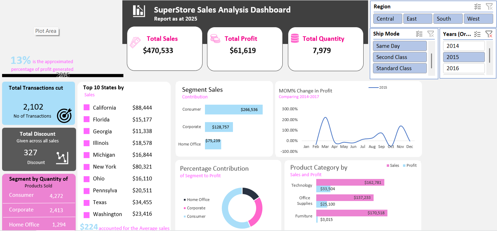

# Project 1

**Title:** [Superstore Sales Analysis Dashboard](https://docs.google.com/spreadsheets/d/1mocHT7e-PmJ47VTs7EyAPmLLJlrU3n3-/edit?usp=drive_link&ouid=115351138416205619957&rtpof=true&sd=true)

**Tools & Techniques Used:** (Pivot Charts, Slicers, Timeline, Power Query, Pivot tables, Time series Analysis, Dashboard Design and Visualization)

**Project Description:** This project focused on analyzing Superstore sales data to evaluate business performance across regions, customer segments, product categories, and time (2014–2017). Using Microsoft Excel, raw transactional data was cleaned, transformed, and visualized into an interactive dashboard that provides actionable insights into sales trends, profitability, discount impact, and customer behavior.

The goal of the project was to support data-driven decision-making by presenting complex sales metrics in a clear, intuitive, and interactive format for business stakeholders.

**Key findings:** 
1. **Overall Business Performance:**
The business generated approximately 2.29 million dollars in sales and 286 thousand dollars in profit, resulting in a 12.5 percent profit margin. Overall performance is positive, with consistent growth over the four-year period. Both revenue and profit increased steadily, indicating effective scaling without margin deterioration. However, profitability is uneven and concentrated in specific categories and products.
2. **Category Performance:**
Technology is the strongest category, contributing the highest profit and maintaining strong margins. It is the primary profit driver of the business.
Office Supplies delivers stable and reliable profitability with balanced performance.
Furniture generates high sales but very low profit. Certain sub-categories, particularly Tables, are loss-making, which significantly reduces overall margins.
3. **Sub-Category & Product Insights:**
Copiers, Phones, and Accessories are the most profitable sub-categories and contribute a large share of total profit.
Tables and some high-end machines generate losses despite reasonable sales, likely due to heavy discounting or high cost structures.
Profit is concentrated in a relatively small number of high-performing products.
4. **Regional Performance:**
The West region leads in both sales and profit, followed by the East.
The Central region underperforms in profitability relative to its sales.
The South region has lower sales but maintains acceptable margins.
5. **Customer Segments:**
The Consumer segment accounts for over 50% of total revenue and is the largest profit contributor.
Corporate and Home Office segments are smaller but profitable, presenting potential growth opportunities.
6. **Key Strategic Observations:**
The company is growing and profitable overall, but margins are heavily dependent on Technology and a few high-performing sub-categories.
Furniture profitability requires urgent review, particularly around discounting and pricing strategy. Improving underperforming products and tightening discount controls could significantly increase overall profit without increasing sales volume.

**Dashboard Overview:**

